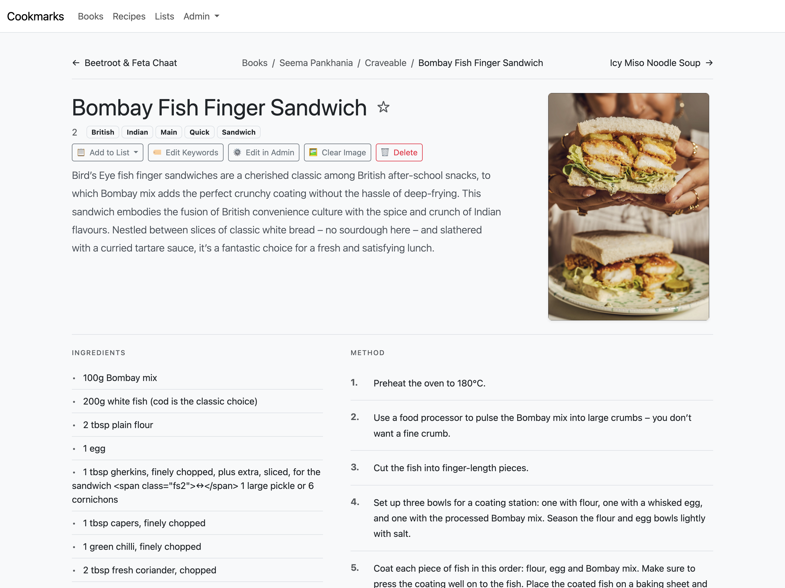

# cookmarks

A Django app for extracting, browsing and organising recipes from digital cookbooks in the EPUB format.

I have a Calibre library with hundreds of EPUB cookbooks, and I got tired of never being able to find that one recipe I vaguely remembered and having to use certain devices to read them. This app uses LLMs to extract the recipes into a structured format and store them into a searchable database so I can actually find and use them.




## Stack

- Python/Django
- SQLite
- HTMX for the interactive bits
- Bootstrap 5 (greyscale minimal aesthetic)
- Works with Gemini or OpenRouter APIs

## How it works

### Calibre integration

The app connects to your Calibre database and syncs metadata for books tagged 'Food' that have epub format. Title, author, publication date, ISBN, description, path on disk.

### Recipe extraction

This is the interesting part. Cookbook layouts are inconsistent, so we use AI to handle the extraction. After research I found three main patterns which the app will detect and extract in the appropriate (and cost-effective) method.

**Many recipes per file** - Books where each chapter has multiple recipes. Typically less than 20 chapter-like files total. Uses higher context models since we're feeding bigger chunks of text.

**One recipe per file** - Books where each recipe lives in its own xhtml file, often with its image right there. Simpler extraction, lower context needed.

**Separate image files** - Recipe text in one set of files, images elsewhere. The app tries to match images to recipes via captions or linking. Falls back to no-image extraction if matching fails.

The process:
1. Open the epub (it's just a zip), find the chapter files
2. Figure out which extraction type applies
3. Send content to the AI with a prompt and schema
4. AI returns structured recipe data as JSON
5. Enrich the data: resolve image references, encode as base64, add book metadata
6. Save to database with proper relationships

Each recipe stores: name, description, author, book link, ingredients, instructions, yields, image, and keywords.

### The frontend

**Books** - Grid of book covers. Filter by author, search by title. Toggle grid/list view. Sorted by when they were added to Calibre.

**Book detail** - Cover, metadata, description. Queue extraction, clear images, update metadata, delete.

**Recipes** - All recipes with filtering by keyword, book, author, list, or search query. Search works across title, ingredients, instructions, keywords, author, and book. Multiselect for bulk adding to lists. Pagination that respects your filters.

**Recipe detail** - Clean layout with image and ingredients/instructions. Breadcrumb navigation showing your context (book, list, or search results). Prev/next arrows navigate within that context. Keyboard shortcut 's' toggles favourite. Actions for lists, keywords, admin edit, clear image, delete.

**Lists** - Organise recipes into collections. There's a default Favourites list that's always there.

**Extraction reports** - History of all extraction attempts with stats: book, method, model, timestamp, recipes found, cost, tokens. Useful for debugging and tracking API usage.

## Configuration

There's a Config singleton that stores:
- AI provider (Gemini or OpenRouter)
- API key
- Extraction rate limit per minute

The app won't let you extract recipes until this is configured.

## Running it

### With Docker Compose

Uses supervisor to run gunicorn and django-q for async extraction jobs.

```
services:
  cookmarks:
    image: cookmarks:latest
    ports:
      - "8789:8789"
    volumes:
      - ./data:/data # holds app sqlite db
      - <path to calibre library>:/books # holds calibre library
    restart: unless-stopped
```
