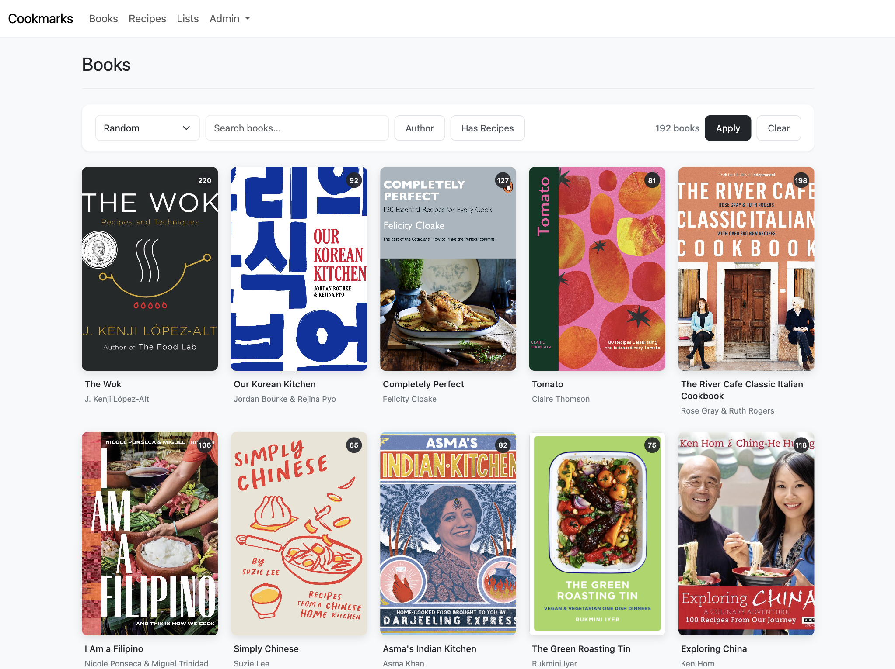

# cookmarks

Cookmarks uses AI to extract and organise recipes from your digital cookbook collection.

## Features

- Import your library from Calibre
- Use AI to extract recipes and images from your books
- Search recipes in loose terms with AI-powered semantic search
- Read books and browse recipes in a comfortable web app
- Organise recipes into lists
- Stores data in [Recipe](https://schema.org/Recipe) schema for portability

## Screenshots

## Stack

- Python/Django web app
- SQLite database with sqlite-vec for vector storage
- DjangoQ2 for background tasks, backed by SQLite
- LangGraph for agentic extraction workflow with human-in-the-loop
- HTMX for web interactivity
- Works with Gemini and OpenRouter on a BYOK basis
- Deployed with Docker Compose

## Getting started

The app can be deployed with Docker Compose for ease, there is a compose file in the repo that can be used as an example.

Django server and DjangoQ2 workers run in the same container, managed by supervisord.

On first run, you will be guided through loading your Calibre library, configuring an AI provider and API key and extracting recipes from your first book.

#### Note on Cost of Extraction

EPUB files are not standardised and vary widely. Most books cost single-digit pennies to extract, but some books with unusual structures can cost up to $0.20 each. The average cost is roughly $7 per 100 books.

## Roadmap

- Mobile app for browsing recipes offline
- Feature to find similar recipes to one
- Export JSON/CSV compatible with popular recipe manager apps like Mealie
