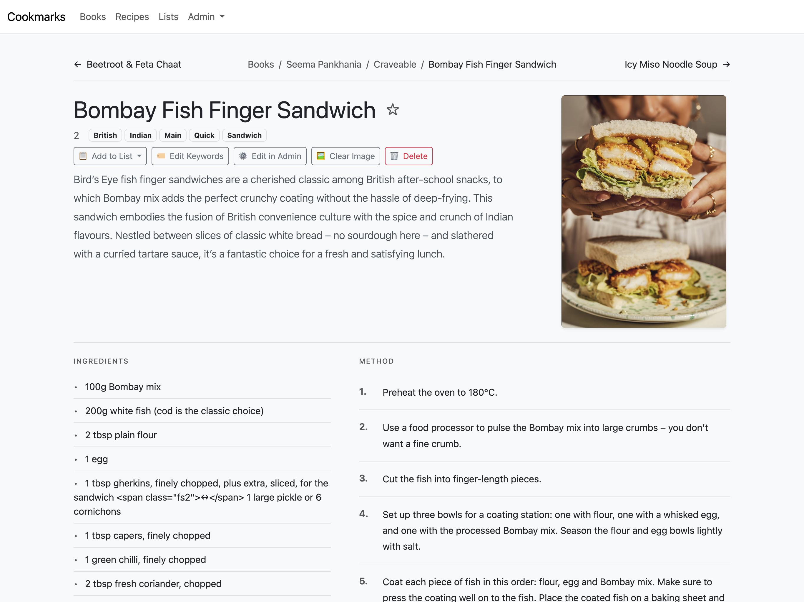
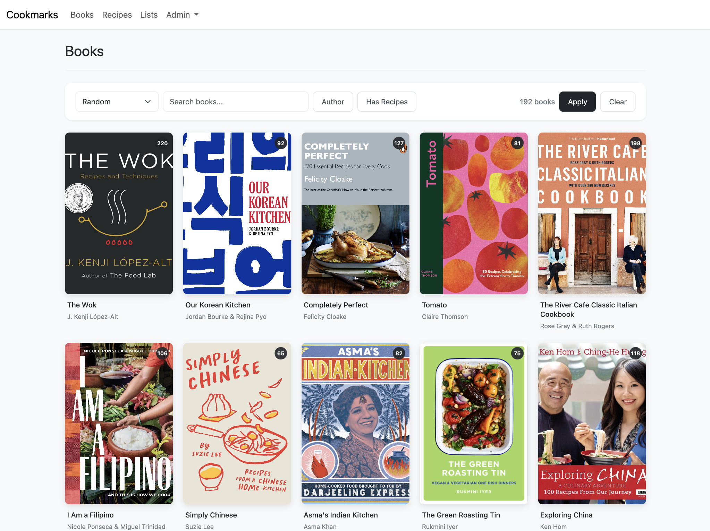

# cookmarks

Cookmarks uses AI to extract and organise recipes from your digital cookbook collection.

## Features

- Import your library from Calibre
- Use AI to extract recipes and images from your books
- Search recipes in loose terms with AI-powered semantic search
- Read books and browse recipes in a comfortable web app
- Organise recipes into lists
- Stores data in [Recipe](https://schema.org/Recipe) schema for portability

## Screenshots





## Stack

- **Backend**: Python / Django with [Django Ninja](https://django-ninja.dev) for the API
- **Frontend**: [SvelteKit](https://kit.svelte.dev) (TypeScript, Bootstrap 5)
- SQLite database with sqlite-vec for vector storage
- DjangoQ2 for background tasks, backed by SQLite
- LangGraph for agentic extraction workflow with human-in-the-loop
- Works with Gemini and OpenRouter on a BYOK basis
- Deployed with Docker Compose (two services: `backend` + `frontend`)

The backend exposes a JSON API under `/api/v1/` (OpenAPI schema at `/api/v1/openapi.json`). The frontend consumes the API and is the only thing the browser talks to in production — it proxies `/api/*` to the backend over the docker network.


## Authentication

By default the app requires login (Django's built-in user model, session cookies). To run as a single-user instance with no login page, set `NO_AUTH=1` in the backend environment — an `admin` user is created automatically and every request is authenticated as that user.

Create a regular user via Django admin (`/admin/`) or:

```bash
uv run python manage.py createsuperuser
```


## Getting started

### Production

Use Docker Compose. The repo ships an example `docker-compose.yml` with two services:

- `backend` — Django + DjangoQ2 worker, port 8789 (internal)
- `frontend` — SvelteKit (adapter-node), exposed on host port 80

Build images and start:

```bash
make build build-frontend
docker compose up -d
```

Mount your Calibre library at `/books` in the backend service.


### Local development

You'll need Python 3.11+, `uv`, Node 22+, and `npm`.

```bash
make dev
```

This runs three processes via [honcho](https://honcho.readthedocs.io):

- `web` — Django dev server on `:8765`
- `worker` — DjangoQ2 cluster
- `frontend` — SvelteKit dev server on `:5173`

Open <http://localhost:5173>. The frontend proxies `/api/*` to the backend.

Use `NO_AUTH=1 make dev` to skip the login page.

To develop against your production SQLite database (read-only Calibre dir):

```bash
make dev-prod
```

On first run you'll be guided through loading your Calibre library, configuring an AI provider, and extracting recipes from your first book.

#### Note on Cost of Extraction

EPUB files are not standardised and vary widely. Most books cost single-digit pennies to extract, but some books with unusual structures can cost up to $0.20 each. The average cost is roughly $7 per 100 books.

## Roadmap

- Mobile app for browsing recipes offline (the JSON API at `/api/v1/` is the foundation)
- Export JSON/CSV compatible with popular recipe manager apps like Mealie
